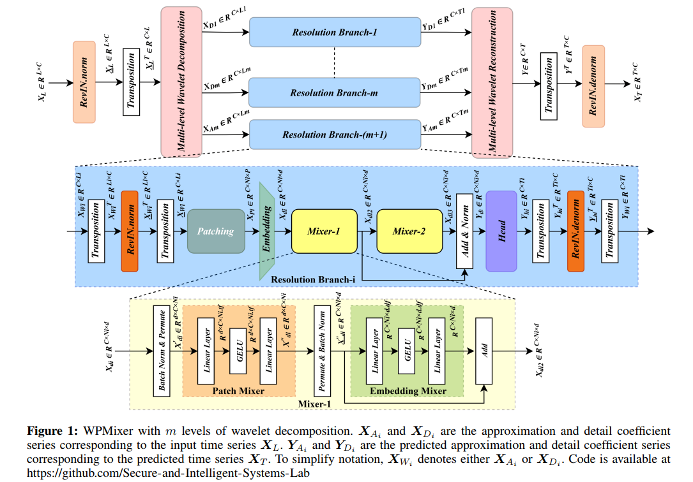
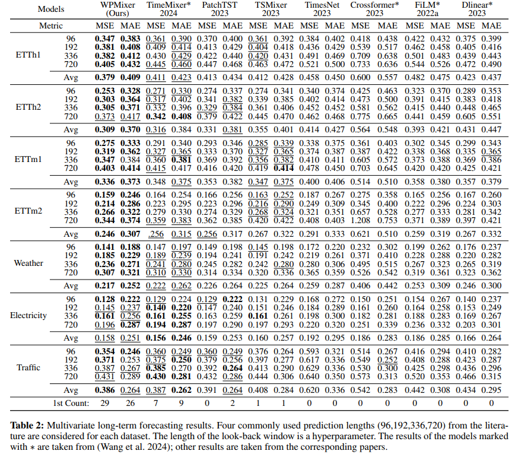
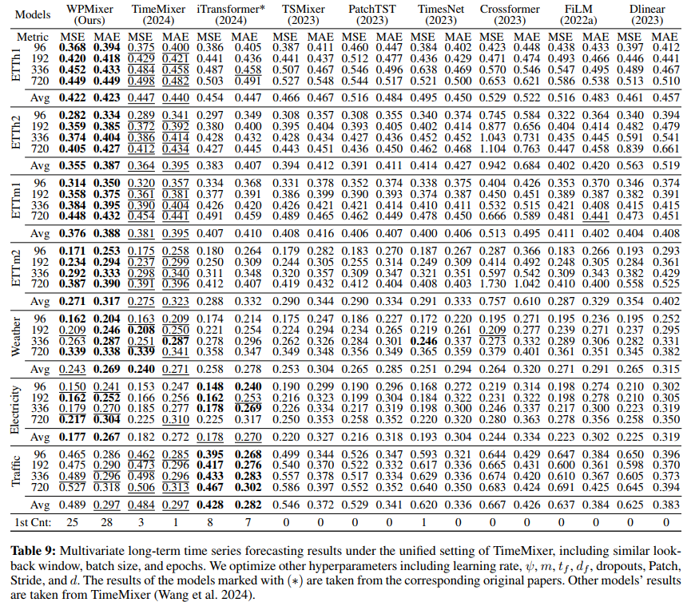
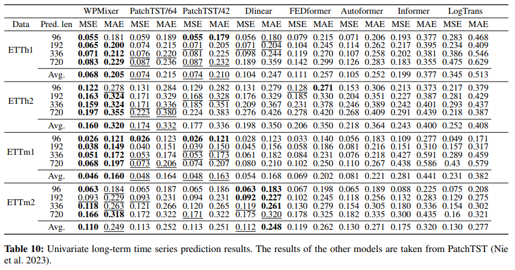

<h1 align="center">WPMixer: Efficient Multi-Resolution Mixing for Long-Term Time Series Forecasting</h1>

<div align="center">

<p><a href="https://arxiv.org/abs/2412.17176"><strong>Full Paper (ARXIV)</strong></a></p>

<hr style="border: 1px solid  #256ae2 ;">

<a href='https://arxiv.org/abs/2412.17176'></a> 


</div>


```bibtex
@inproceedings{murad2025wpmixer,
  title={Wpmixer: Efficient multi-resolution mixing for long-term time series forecasting},
  author={Murad, Md Mahmuddun Nabi and Aktukmak, Mehmet and Yilmaz, Yasin},
  booktitle={Proceedings of the AAAI Conference on Artificial Intelligence},
  volume={39},
  number={18},
  pages={19581--19588},
  year={2025}
}
```
## 🔄 Updates
- **[June 2025]** 🔥🔥🔥 Rethinking MLP-Mixers: Causality Matters! One Embedding Layer or More? [Check out this paper](https://arxiv.org/abs/2506.00188)
- **[May 2025]** Added a script for **hyperparameter tuning** using Optuna under `./scripts/HyperParameter_Tuning/`. These scripts explore optimal hyperparameter settings for ETT dataset.


## Get started
Follow these steps to get started with WPMixer:
### 1. Install Requirements
Install Python 3.10 and the necessary dependencies.

```bash
pip install -r requirements.txt
```
### 2. Download Data
<b>Process-1:</b>
Download the zip file of the datasets from the [link](https://usf.box.com/s/8ghqgtxfp1hw3rfvocr2s5gjf7w4x3ol).
Paste the zip file inside the <u>root folder</u> and extract. Now you will have ```./data/``` folder containing all the datasets.
 
Or, 
<b>Process-2:</b>
Download the data and locate them in the ```./data/``` folder. You can download all data from the public GitHub repo: [Autoformer](https://github.com/thuml/Autoformer) or [TimeMixer](https://github.com/kwuking/TimeMixer). All the datasets are well-pre-processed and can be used easily. To place and rename the datasets file, check the following folder tree,
```
data
├── electricity
│   └── electricity.csv
├── ETT
│   ├── ETTh1.csv
│   ├── ETTh2.csv
│   ├── ETTm1.csv
│   └── ETTm2.csv
├── exchange_rate
│   └── exchange_rate.csv
├── illness
│   └── national_illness.csv
├── m4
├── solar
│   └── solar_AL.txt
├── traffic
│   └── traffic.csv
└── weather
    └── weather.csv
```

    
### 3. Train the model
We provide the experiment scripts of all benchmarks under the folder ```./scripts/``` to reproduce the results. Running those scripts by the following commands will generate logs in the ```./logs/WPMixer/``` folder.

#### Multivariate long-term forecasting results with full hyperparameter search settings (Table-2):
```
bash ./scripts/Full_HyperSearch/ETTh1_full_hyp.sh
bash ./scripts/Full_HyperSearch/ETTh2_full_hyp.sh
bash ./scripts/Full_HyperSearch/ETTm1_full_hyp.sh
bash ./scripts/Full_HyperSearch/ETTm2_full_hyp.sh
bash ./scripts/Full_HyperSearch/Weather_full_hyp.sh
bash ./scripts/Full_HyperSearch/Electricity_full_hyp.sh
bash ./scripts/Full_HyperSearch/Traffic_full_hyp.sh
```

#### Multivariate long-term forecasting results with unified settings (Table-9 in Supplementary):
```
bash ./scripts/Unified/ETTh1_Unified_setup.sh
bash ./scripts/Unified/ETTh2_Unified_setup.sh
bash ./scripts/Unified/ETTm1_Unified_setup.sh
bash ./scripts/Unified/ETTm2_Unified_setup.sh
bash ./scripts/Unified/Weather_Unified_setup.sh
bash ./scripts/Unified/Electricity_Unified_setup.sh
bash ./scripts/Unified/Traffic_Unified_setup.sh
```
#### Univariate long-term forecasting results (Table-10 in Supplementary):
```
bash ./scripts/Univariate/ETTh1_univariate.sh
bash ./scripts/Univariate/ETTh2_univariate.sh
bash ./scripts/Univariate/ETTm1_univariate.sh
bash ./scripts/Univariate/ETTm2_univariate.sh
```

<hr style="border: 1px solid #FF5733;">

<h1 align="center" style="color: #256ae2 ;">Brief Overview of the Paper</h1>

<hr style="border: 1px solid #FF5733;">

<p><strong>Abstract</p>
Time series forecasting is crucial for various applications, such as weather forecasting, power load forecasting, and financial analysis. In recent studies, MLP-mixer models for time series forecasting have been shown as a promising alternative to transformer-based models. However, the performance of these models is still yet to reach its potential. In this paper, we propose Wavelet Patch Mixer (WPMixer), a novel MLP-based model, for long-term time series forecasting, which leverages the benefits of patching, multi-resolution wavelet decomposition, and mixing. Our model is based on three key components: (i) multi-resolution wavelet decomposition, (ii) patching and embedding, and (iii) MLP mixing. Multi-resolution wavelet decomposition efficiently extracts information in both the frequency and time domains. Patching allows the model to capture an extended history with a look-back window and enhances capturing local information while MLP mixing incorporates global information. Our model significantly outperforms state-of-the-art MLP-based and transformer-based models for long-term time series forecasting in a computationally efficient way, demonstrating its efficacy and potential for practical applications.
    
<p><strong>Model Architecture:</p>
<p align="center">
  
</p>

<p><strong>Multivariate Long-Term Forecasting Results with full hyperparameter searching:</p>
<p align="center">
  
</p>

<p><strong>Multivariate Long-Term Forecasting under Unified Setting:</p>
<p align="center">
  
</p>
    
<p><strong>Univariate Long-term forecasting result:</p>
<p align="center">
  
</p>
